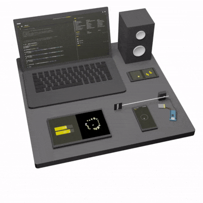

# PHONK

[](https//github.com/victordiaz/phonk)
[](https://github.com/victordiaz/phonk/issues)

**PHONK is a coding playground for new and old Android devices.**

Create scripts rapidly from your phone or using the *remote Web Editor* on your computer using Javascript. The API is simple and extensive. GUI, audio, graphics, Bluetooth BLE, Arduino, OSC, MIDI, and much more.

[PHONK Website](https://phonk.app) — [Tutorial](https://phonk.app/docs/1_step_installation) — [Forum](https://github.com/victordiaz/PHONK/discussions) — [Discord](https://discord.gg/DgtyBKgp)

# 

## Features
- Takes 1 min to set up on your phone
- No need to install anything on your computer
- PHONK uses JavaScript but it calls native Java functions, getting close to native speed
- Simplified API. Create custom interfaces and access on-device sensors in a couple of lines of code
- Pseudo Live Coding (select your code and Control (or Cmd) + Enter to live execute)
- Bluetooth and Arduino in a few lines of code
- MQTT, HTTP requests, WebSockets, OSC, MIDI
- Access to Processing.org API
- Use your PureData skills thanks to the embedded LibPd
- OpenStreetMaps and muuuch more!

## How to install it
Get it from
- [APK](https://github.com/victordiaz/phonk/releases)
- ~~[F-droid](https://github.com/victordiaz/phonk/issues/6)~~ (Need help)
- [Play Store](https://play.google.com/store/apps/details?id=io.phonk)
- or just [compile it your self]()

If you have an Android phone with a version higher than 4.1 (that's from 2012!) then it should work! If you find a problem, please [create an issue](https://github.com/victordiaz/phonk/issues/new).

During the first install, the app will
1. Ask you for a bunch of permissions. I recommend accepting all of them to be able to run the examples. You can always revoke them :)
2. Install the examples in the device "sdcard" folder. Doing this we can easily access the examples and self-made scripts from any other app.

## How to create your first script
> Check the [Getting started guide](http://phonk.io/getstarted) for a more detailed explanation

Run the PHONK app in your Android device. You can create your first script within the device, although it might be a bit cumbersome using the device virtual keyboard.

Instead, connect your computer and Android to the same Wi-Fi network. On your computer open the browser and type the IP address indicated on your phone after pressing "Start web editor". A web editor will load, allowing you to code on the phone.

You can create a new project and copy and paste this into the editor.

``` js
// ui elements need x, y, w, h normalized paramaters
ui.addButton('Start accelerometer', 0.1, 0.45, 0.8, 0.1).onClick(function () {
  sensors.accelerometer.start()
})

sensors.accelerometer.onChange(function (e) {
  console.log(e.x, e.y, e.z)
})
```

Now run the project. :tada:

You can explore the variety of examples included in PHONK and modify them in order to explore its capabilities.


## Compile it yourself
PHONK depends on 3 subprojects. Each of them is on a different repository so things are a bit easy to manage.
1. The main PHONK Android project (this repo)
2. The Web Editor [https://github.com/victordiaz/phonk-editor](https://github.com/victordiaz/phonk-editor)
3. The examples [https://github.com/victordiaz/phonk-examples](https://github.com/victordiaz/phonk-examples)

In order to compile PHONK you should fetch the 3 repos so they follow the following folder structure.
``` bash
phonk_project
 ├ phonk # the Android project
 ├ phonk-editor
 └ phonk-examples
```

Once you fetched all projects, you should 
1. Copy the examples to the Android assets folder. Go to the phonk-examples folder and run ```npm run cleanAndDeploy```
2. Add the Web Editor to the Android app asset folder. Go to the phonk-editor folder, ```npm install``` to install the Web Editor dependencies and finally run ```npm run buildAndDeploy``` to build the Web Editor and copy 
3. In Android Studio import the phonk folder and build the project.

Once you've done that, there is no necessity to do the first steps anymore unless you want to update the Web Editor or the examples.

### Project structure
The PHONK app is divided into two modules: phonk_app and phonk_apprunner.
- *phonk_app* is the app that you see when you start PHONK and it manages all the stuff to let you make projects.
- *phonk_apprunner* is the part in charge of running the scripts and it contains all the API. If you want to add or improve the API you can go to the folder [phonk/phonk_apprunner/src/main/java/io/phonk/runner/apprunner/api](https://github.com/victordiaz/phonk/tree/master/phonk_apprunner/src/main/java/io/phonk/runner/apprunner/api). All the methods you include there will automatically be exposed to JavaScript.

## Get Involved
- Write about it
- Make something with PHONK.app and tell me about it. I would love to know how you use it. (GitHub, e-mail, etc.)
- Have a look at the [issues](https://github.com/victordiaz/phonk/issues)

## Roadmap
- ~~Getting started guide~~
- Improve documentation
- How-to-contribute guide

## License
This project is licensed under the terms of the GPL / LGPL v3 License. You can check out the full LICENSE description on the file LICENSE.txt.
