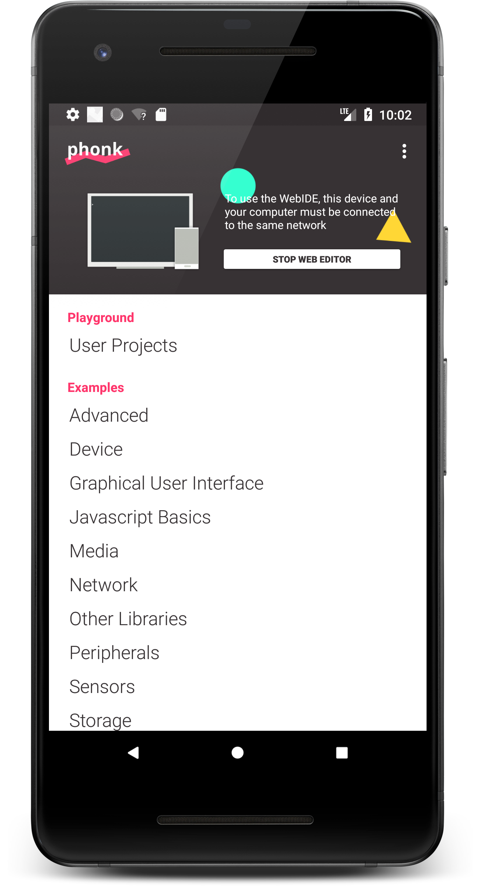
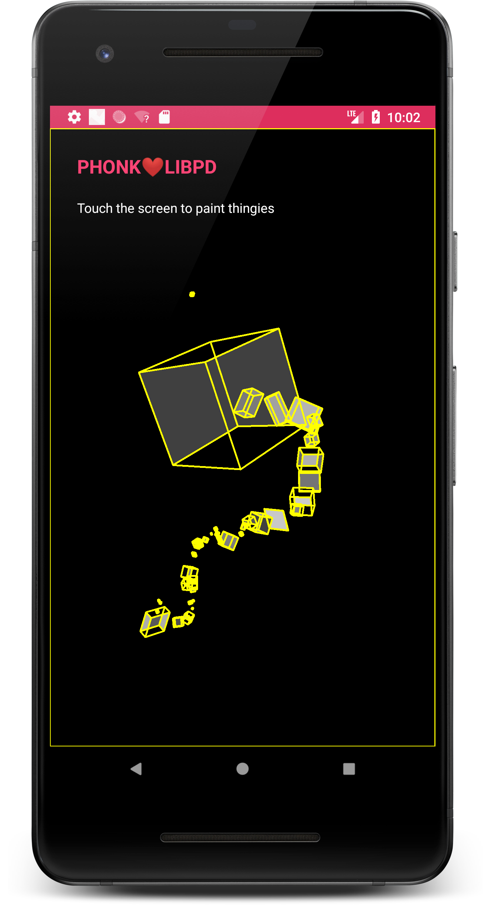

#  Phonk
**Phonk is a self-contained, creative coding environment for Android Devices.**

## Introduction
:tada: Hello! I'm happy to see you here reading about Phonk!!

Phonk is an app for your Android device(s) that lets you make cool stuff programming your phone or tablet in an easy, fast and enjoyable way. 
You can code directly from the Android device or using the remote Editor from your computer using your web browser.
Pick an old phone (or new) from the drawer and transform it into a robot, a music device, or make cool graphics.

  
  
  

## Features
- Takes 1 min to setup in your phone.
- No need to install anything in your computer
- Uses Javascript thanks to Mozilla Rhino, an old but powerful library that exposes Java to Javascript
- Simplified API. Create custom interfaces and access on-device sensors in a couple of lines of code
- Pseudo Live Coding (Select your code and Control + x to live execute)
- Bluetooth and Arduino in few lines of code
- MQTT, Http requests, Websockets, OSC, Midi
- Access to Processing.org API
- Use your PureData skills thanks to the embed LibPd
- OpenStreetMaps and muuuch more!

## How to install it
Get it from
- [APK](https://github.com/victordiaz/phonk/releases)
- ~~[F-droid](https://github.com/victordiaz/phonk/issues/6)~~ (Need help)
- ~~[Play Store]()~~ (Waiting for approval)
- ~~or just [compile it your self]().~~

If you have an Android phone with a version higher than 4.1 (that's from 2012!) then it should work! If you find a problem, please [create an issue](https://github.com/victordiaz/phonk/issues/new).

## How to create your first script
Run the Phonk app in your Android device. You can create your first script within the device although it might be a bit cumbersome using the device virtual keyboard.

Instead, connect your computer and Android to the same Wifi network. On your computer open the browser and type the ip address indicated on your phone after pressing "Start web editor". A web editor will load allowing you to code on the phone.

You can create a new project and copy and paste this into the editor.

     sensors.accelerometer.onChange(function (data) {
       console.log(data.x, data.y, data.z)
     })

Now run the project.
You can explore the variety of examples included in Phonk and modify them in order to explore its capabilities.

## Philosophy
- TODO

## Get Involved
- Write about it
- Make something with Phonk.io and share it (github, e-mail, etc)
- TODO

## Roadmap
- TODO

## Contributors / Credits
- TODO

## Support
- TODO

## License
This project is licensed under the terms of the GPL / LGPL v3 License. You can check out the full LICENSE description on the file LICENSE.txt.
